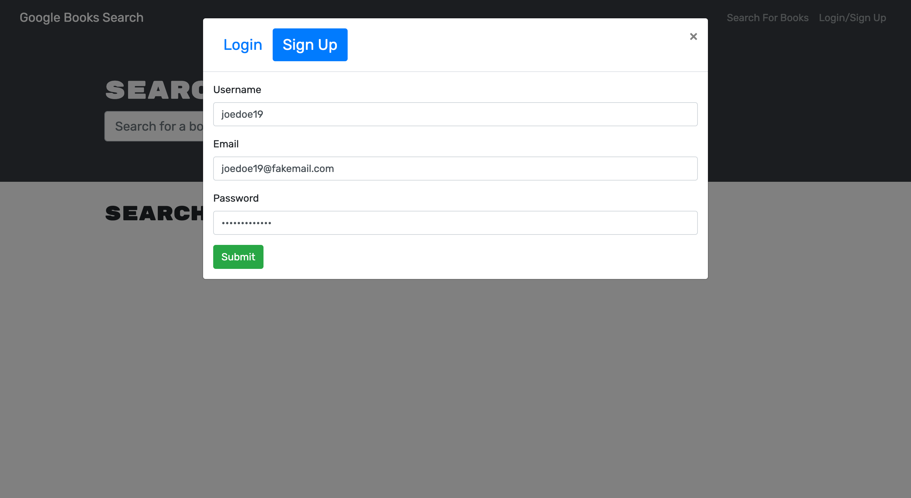
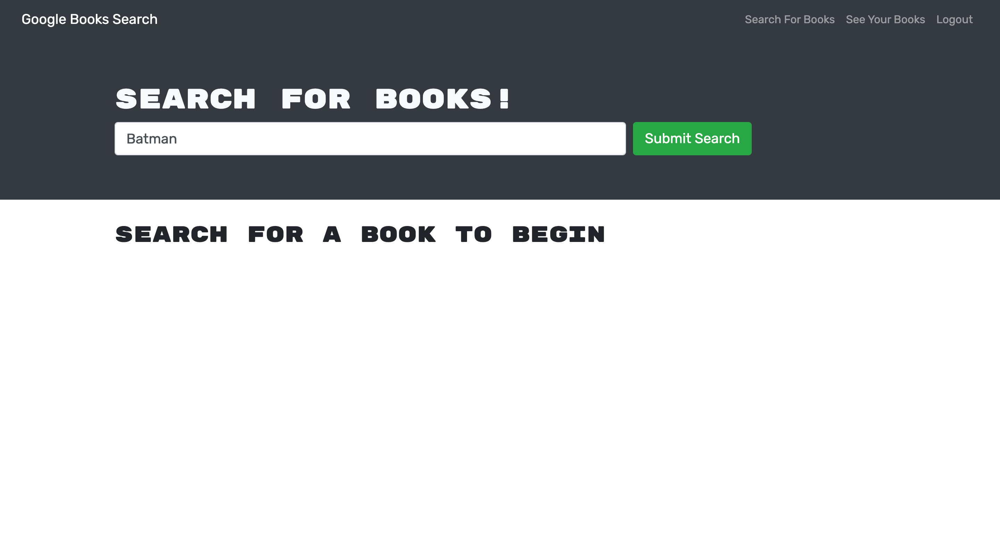
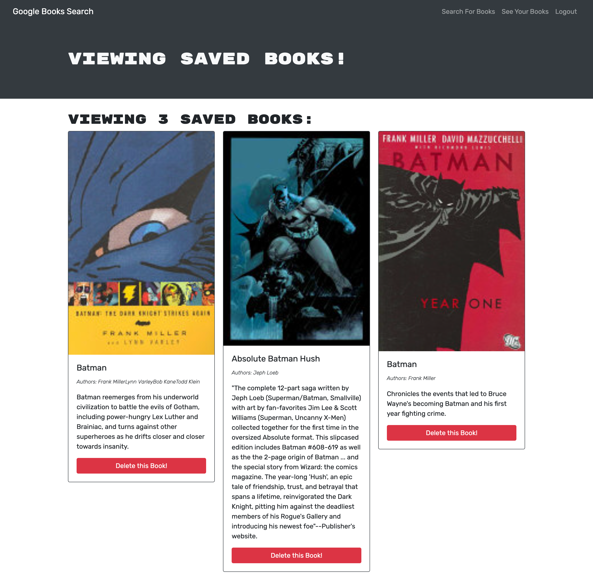
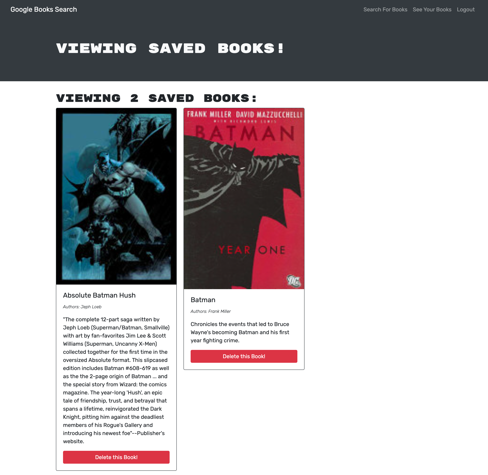

# jvma-book-finder
This MERN stack application is a Book Search Engine refactored to be a GraphQL API built with Apollo Server.

## Description

This was an on-the-job ticket activity where I was given starter code with a fully functioning Google Books API search engine built with a RESTful API. The app was already built using the MERN stack with a React front-end, MongoDB database, and Node.js/Express.js server and API. The assignment was to refactor the application to be a GraphQL API built with Apollo Server. The application allows users to sign up or login, search for any book, which displays the results with title, authors, image, description and a "Save This Book!" button. This button allows users to save the desired book to their users account, then they can navigate to the "See Your Books" section and get all the books they have saved. In this section the results are displayed with a "Delete This Book!" button, which let's the users to remove the book from their collection of saved books.

To begin the refactoring of the application, first I updated the `auth.js` file, modifying the auth middleware function to work with the GraphQL API. Then, I took the `server.js` file and implemented the Apollo Server, applying it to the Express server as middleware.

For the next part, in the Back-End, I created a `Schemas` directory with `index.js`, `resolvers.js` and `typeDefs.js` files. In the `index.js` file I exported the typeDefs and resolvers. For the `resolvers.js` file I defined the query and mutation functions which would work with the Mongoose models. The functions created were Query `me` and Mutations `loginUser`, `addUser`, `saveBook` and `removeBook`. After this, in the `typeDefs.js` file I defined `type User`, `type Book`, `type Auth`, `type Query` `me` `input BookInput` and `type Mutation` `loginUser`, `addUser`, `saveBook` and `removeBook`.

The following part was to refactor several files in the Front-End. First, I created the `queries.js` file with the `GET_ME` query, to execute the `me` query using the Apollo Server. Next, I created the `mutations.js` file, which contains `LOGIN_USER` (to execute `loginUser` mutation), `ADD_USER` (to execute `addUser` mutation), `SAVE_BOOK` (to execute `saveBook` mutation) and `REMOVE_BOOK` (to execute `removeBook` mutation). Then, I modified the code  `App.js`, creating an Apollo Provider to make all requests work with the Apollo Server. Then, in `SearchBooks.js` I used the `useMutation()` Hook to execute the `SAVE_BOOK` mutation in the `handleSaveBook()` function. After that, I refactored the code in `SaveBook.js`, removing the `useEffect()` Hook, using the `useQuery()` Hook to execute the `GET_ME` query on load and save it to `const userData = data?.me || {}`. In that same file, I implemented the `useMutation()` Hook to execute the `REMOVE_BOOK` mutation in the `handleDeleteBook()` function. 

Finally, again in the Front-End, I modified the code in `SignupForm.js`, replacing the `addUser()` functionality with the `ADD_USER` mutation. The last part was to modify the code in `LoginForm.js`, replacing the `loginUser()` functionality with the `LOGIN_USER` mutation.

## Usage & [Deployed Application](https://jvma-book-finder.herokuapp.com/)

This is the link to the deployed application in Heroku: https://jvma-book-finder.herokuapp.com/

Here are some images of the application in use:

 

## Technologies Used

* JavaScript
* HTML
* CSS
* Node.js
* NPM
* React.js
* MongoDB
* Mongoose
* GraphQL Package
* Express package
* Apollo Server Express package
* Json Web Token package
* Bootstrap
* bcrypt package
* Nodemon package
* Heroku

## Contact Information

* GitHub Profile: [josevidmal](https://github.com/josevidmal)
* email: josevidmal@gmail.com

## License

[The MIT License](https://www.mit.edu/~amini/LICENSE.md)

Copyright 2022 Jose Vidal

Permission is hereby granted, free of charge, to any person obtaining a copy of this software and associated documentation files (the "Software"), to deal in the Software without restriction, including without limitation the rights to use, copy, modify, merge, publish, distribute, sublicense, and/or sell copies of the Software, and to permit persons to whom the Software is furnished to do so, subject to the following conditions:
    
The above copyright notice and this permission notice shall be included in all copies or substantial portions of the Software.
    
THE SOFTWARE IS PROVIDED "AS IS", WITHOUT WARRANTY OF ANY KIND, EXPRESS OR IMPLIED, INCLUDING BUT NOT LIMITED TO THE WARRANTIES OF MERCHANTABILITY, FITNESS FOR A PARTICULAR PURPOSE AND NONINFRINGEMENT. IN NO EVENT SHALL THE AUTHORS OR COPYRIGHT HOLDERS BE LIABLE FOR ANY CLAIM, DAMAGES OR OTHER LIABILITY, WHETHER IN AN ACTION OF CONTRACT, TORT OR OTHERWISE, ARISING FROM, OUT OF OR IN CONNECTION WITH THE SOFTWARE OR THE USE OR OTHER DEALINGS IN THE SOFTWARE.